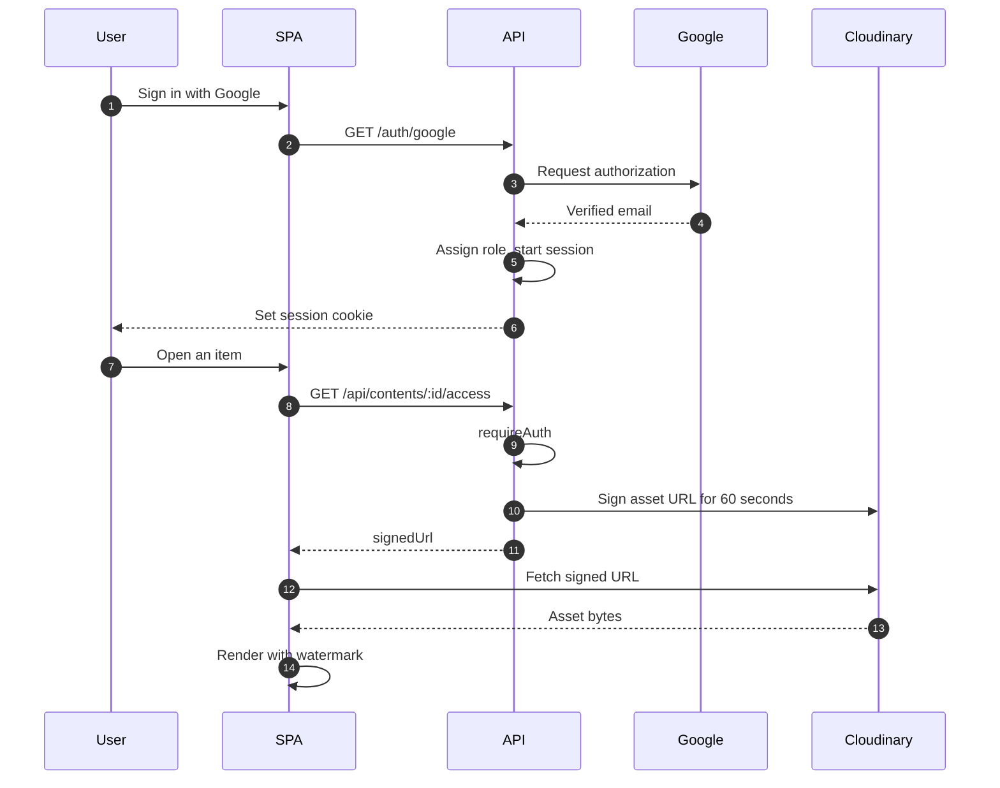
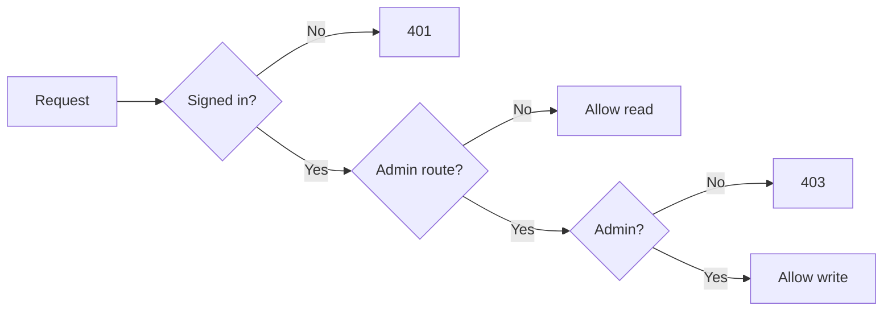

# Secure Content Portal

A full-stack, role-based library for distributing videos, PDFs and HTML documents to authenticated users — without ever exposing a permanent asset URL. Every file is delivered through a signed, single-purpose URL that expires 60 seconds after it is issued.

[](https://nodejs.org)
[](https://expressjs.com)
[](https://react.dev)
[](https://vite.dev)
[](https://tailwindcss.com)
[](https://www.pingcap.com/tidb-cloud/)
[](https://cloudinary.com)
[](https://render.com)
[](https://vercel.com)

---

## Table of Contents

- [Overview](#overview)
- [Features](#features)
- [Architecture](#architecture)
- [Request Flows](#request-flows)
- [Tech Stack](#tech-stack)
- [Project Structure](#project-structure)
- [Data Model](#data-model)
- [API Reference](#api-reference)
- [Security Design](#security-design)
- [Local Development](#local-development)
- [Environment Variables](#environment-variables)
- [Deployment](#deployment)
- [Operational Notes](#operational-notes)

---

## Overview

Secure Content Portal solves a specific problem: sharing internal media and documents with a group of people without handing out links that live forever.

Assets are uploaded to Cloudinary by an administrator, the record is stored in MySQL, and the stored asset URL never leaves the server. When a user opens an item, the API asks Cloudinary to sign a URL for that specific asset with a 60-second expiry. Once that window closes the signature is rejected by the CDN and the client has to request a fresh link.

Authentication is handled by Google OAuth 2.0. The first account matching `ADMIN_EMAIL` is provisioned as an `admin`; every other account is provisioned as a `viewer` and can only read. Viewers never receive write endpoints — the restriction is enforced server-side by middleware, not by hiding buttons in the UI.

---

## Features

**Authentication and identity**

- Google OAuth 2.0 sign-in via `passport-google-oauth20` — no password storage anywhere in the system.
- Server-side sessions (`express-session`) with a `memorystore` backing store, `httpOnly` cookies, and a 24-hour lifetime.
- Roles are derived from `ADMIN_EMAIL` on every sign-in and persisted with `ON DUPLICATE KEY UPDATE`, so a mis-set role repairs itself on the next login instead of staying broken.

**Content management**

- Upload `.mp4`, `.pdf` and `.html`, validated on both MIME type and file extension, capped at 50 MB and streamed to Cloudinary from memory (no temp files on disk).
- Edit title, description and category; delete removes the record *and* the underlying Cloudinary asset.
- Server-side filtering and search by title, description or category, with type and category facets and sorting.

**Secure delivery**

- Every asset is served through a Cloudinary signed URL with `expires_at` set to 60 seconds in the future.
- The stored asset URL is never returned by any endpoint — the client only ever receives a signed, expiring link.
- Live countdown in the viewer with explicit link refresh when the window closes.
- Per-user diagonal watermark rendered over every viewing surface.

**Viewer**

- Continuous, zoomable multi-page PDF rendering on `<canvas>` via PDF.js with a floating toolbar (`−` / fit / `+`) and a live page indicator.
- Native video playback with download and picture-in-picture controls suppressed.
- HTML previews isolated in a sandboxed `iframe`.

---

## Architecture

<!-- ARCHITECTURE DIAGRAM
     Place your exported architecture image at docs/architecture.png
     (docs/architecture.svg also works) and the figure below will render.
     Keep the alt text descriptive so the README still reads correctly on
     GitHub mobile, in screen readers, and when images are disabled.
-->


### Components

| Layer | Technology | Responsibility |
| :--- | :--- | :--- |
| Single-page app | React 19 + Vite 8, Tailwind CSS 4 | Dashboard, search and filtering, viewer, admin modals |
| API | Node.js + Express 5 | OAuth handshake, session management, RBAC, signed-URL issuance, content CRUD |
| Identity provider | Google OAuth 2.0 | Authenticates the user and returns the verified email used for role assignment |
| Database | TiDB Cloud Serverless (MySQL protocol, TLS 1.2+) | `users` and `contents` tables, view counters |
| Object storage | Cloudinary | Stores assets; issues the time-limited signed delivery URLs |
| Hosting | Render (API) + Vercel (SPA) | Two independent deploy targets communicating over credentialed CORS |

### How the pieces connect

- The SPA holds no secrets. Its only configuration is `VITE_API_URL`, which is inlined at build time.
- The API owns every credential — Cloudinary, Google and MySQL keys exist only in the server environment.
- The browser never contacts Cloudinary until it has been handed a signed URL, and that URL is scoped to one asset for 60 seconds.
- `file_path` (the stored Cloudinary URL) is deliberately excluded from every list, read and create response.

---

## Request Flows

### Sign-in and secure access



### Authorization

Three rules cover every route.



| Access level | Routes |
| :--- | :--- |
| Public | `/healthz`, `/auth/*` |
| Signed in | `GET /api/contents`, `GET /api/contents/:id/access` |
| Admin | `POST`, `PUT`, `DELETE /api/contents` |

---

## Tech Stack

### Backend

| Package | Version | Purpose |
| :--- | :--- | :--- |
| `express` | 5.2.1 | HTTP server and routing |
| `passport` + `passport-google-oauth20` | 0.7.0 / 2.0.0 | Google OAuth 2.0 strategy |
| `express-session` + `memorystore` | 1.19.0 / 1.6.8 | Server-side sessions with a production-safe store |
| `mysql2` | 3.24.4 | Connection-pooled MySQL client with TLS |
| `multer` | 2.3.0 | In-memory multipart uploads with an allowlist filter |
| `cloudinary` | 2.11.0 | Asset storage and signed-URL generation |
| `cors` | 2.8.6 | Single-origin credentialed CORS |
| `dotenv` | 17.4.2 | Environment configuration |

### Frontend

| Package | Version | Purpose |
| :--- | :--- | :--- |
| `react` + `react-dom` | 19.2.8 | UI runtime |
| `vite` | 8.2.2 | Dev server and production bundler |
| `tailwindcss` + `@tailwindcss/postcss` | 4.3.3 | Utility-first styling |
| `axios` | 1.20.0 | API client with `withCredentials` |
| `pdfjs-dist` | 4.10.38 | PDF parsing and canvas rendering |
| `lucide-react` | 1.42.0 | Icon set |

---

## Project Structure

```text
secure-content-portal/
├── server.js                  # Express entry point: CORS, sessions, routes, error handler
├── db.js                      # mysql2 connection pool with TLS
├── schema.sql                 # users and contents DDL
├── render.yaml                # Render service definition
├── .env.example               # Environment variable template
│
├── config/
│   ├── cloudinary.js          # Cloudinary SDK configuration
│   └── passport.js            # Google strategy, role assignment, session serialization
│
├── middleware/
│   ├── auth.js                # requireAuth / requireAdmin guards
│   └── upload.js              # multer instance: memory storage, 50 MB cap, MIME + extension filter
│
├── routes/
│   ├── auth.js                # /auth/google, callback, /auth/me, /auth/logout
│   └── contents.js            # CRUD plus /:id/access signed-URL issuance
│
├── scripts/
│   └── init-db.js             # Applies schema.sql against the configured database
│
└── client/
    ├── vite.config.js
    ├── vercel.json            # SPA rewrite rules
    └── src/
        ├── api.js             # Axios instance and API base URL
        ├── App.jsx            # Auth-gated route shell
        ├── main.jsx
        ├── index.css          # Tailwind entry and base styles
        ├── context/
        │   └── AuthContext.jsx       # Session state, login and logout helpers
        └── components/
            ├── Dashboard.jsx         # Library grid, search, filters, sorting
            ├── Header.jsx            # App bar, search input, user menu
            ├── Login.jsx             # Unauthenticated landing page
            ├── Modal.jsx             # Shared dialog shell
            ├── PdfRenderer.jsx       # Continuous canvas PDF viewer with zoom toolbar
            ├── SecureViewerModal.jsx # Viewer shell: watermark, countdown, media stage
            ├── ui.jsx                # Shared button, badge and tag primitives
            └── modals/
                ├── UploadContentModal.jsx
                ├── EditContentModal.jsx
                └── DeleteContentModal.jsx
```

---

## Data Model

Defined in [`schema.sql`](schema.sql). Both tables are InnoDB with `utf8mb4`.

### `users`

| Column | Type | Notes |
| :--- | :--- | :--- |
| `id` | `VARCHAR(255)` | Primary key — the Google account id |
| `email` | `VARCHAR(255)` | Unique; matched against `ADMIN_EMAIL` to determine role |
| `name` | `VARCHAR(255)` | Display name from the Google profile |
| `role` | `ENUM('admin','viewer')` | Defaults to `viewer` |
| `created_at` | `TIMESTAMP` | Defaults to the current timestamp |

### `contents`

| Column | Type | Notes |
| :--- | :--- | :--- |
| `id` | `INT AUTO_INCREMENT` | Primary key |
| `title` | `VARCHAR(255)` | Required |
| `description` | `TEXT` | Optional |
| `category` | `VARCHAR(100)` | Optional; indexed |
| `type` | `ENUM('video','pdf','html')` | Derived from the uploaded MIME type; indexed |
| `file_path` | `VARCHAR(500)` | Cloudinary `secure_url` — server-side only, never returned by the API |
| `views_count` | `INT` | Incremented on each authorized access |
| `created_at` | `TIMESTAMP` | Defaults to the current timestamp |

---

## API Reference

Base URL: `VITE_API_URL` on the client, `http://localhost:5000` in development.

| Method | Endpoint | Guard | Description |
| :--- | :--- | :--- | :--- |
| `GET` | `/healthz` | Public | Liveness probe used by Render |
| `GET` | `/auth/google` | Public | Redirects to Google's consent screen |
| `GET` | `/auth/google/callback` | Public | OAuth callback; provisions the user, then redirects to `CLIENT_URL` |
| `GET` | `/auth/me` | `requireAuth` | Returns `{ id, email, name, role }` for the current session |
| `POST` | `/auth/logout` | Public | Destroys the session and clears the cookie |
| `GET` | `/api/contents` | `requireAuth` | Lists all content. Never includes `file_path` |
| `GET` | `/api/contents/:id/access` | `requireAuth` | Returns `{ id, title, type, signedUrl, expiresInSeconds }` and increments `views_count` |
| `POST` | `/api/contents` | `requireAuth`, `requireAdmin` | Multipart upload (`file` field, max 50 MB). Returns `201` with the created record |
| `PUT` | `/api/contents/:id` | `requireAuth`, `requireAdmin` | Updates `title`, `description` and/or `category` via `COALESCE` |
| `DELETE` | `/api/contents/:id` | `requireAuth`, `requireAdmin` | Destroys the Cloudinary asset, then deletes the row |

### Error responses

| Status | Meaning |
| :--- | :--- |
| `400` | Invalid id, nothing to update, or disallowed file type |
| `401` | No authenticated session |
| `403` | Authenticated but not an `admin` |
| `404` | Content not found |
| `413` | Upload exceeded the 50 MB limit |
| `500` | Unhandled server error |

---

## Security Design

The threat model is a legitimate but non-admin user (or anyone who obtains a link) trying to exfiltrate assets or escalate privileges. Each control below addresses a specific vector.

### Access control

| Control | Implementation |
| :--- | :--- |
| Authentication | Google OAuth 2.0 only. No passwords are ever stored or transmitted. |
| Authorization | `requireAuth` and `requireAdmin` middleware in `middleware/auth.js`, applied per route. |
| Role source of truth | `ADMIN_EMAIL` is re-evaluated on every login, so a stale or tampered role in the database is corrected automatically. |
| Privilege escalation | Write routes are guarded server-side; the UI hiding buttons is a convenience, not the control. |

### Session handling

| Control | Implementation |
| :--- | :--- |
| Cookie flags | `httpOnly: true`, `secure: true` under `NODE_ENV=production`, `maxAge` of 24 hours. |
| Cross-site delivery | `SameSite=None` in production (required because the SPA and API are on different origins) and `Lax` in development. |
| Reverse proxy | `app.set('trust proxy', 1)` so secure cookies are correctly recognised behind Render's proxy. |
| Store | `memorystore` instead of the default in-memory store, with a daily cleanup interval. |
| Logout | Destroys the session and clears the cookie with matching attributes. |

### Asset delivery

| Control | Implementation |
| :--- | :--- |
| No permanent URLs | `file_path` is excluded from every API response; the client only ever receives a signed URL. |
| Expiry | `expires_at` is set to `now + 60` seconds and `sign_url: true`, so Cloudinary rejects the URL after the window closes. |
| Signing scope | The signature covers a single `public_id` — a leaked URL cannot be widened to other assets. |
| Resource type parity | `video` for `.mp4`, `raw` for `.pdf`/`.html`, matching how the asset was uploaded. |
| Cleanup | Deleting a record also destroys the stored asset so removed material is not left retrievable. |

### Client-side hardening

These raise the cost of casual copying. They are deterrents layered on top of the server-side controls above, not a substitute for them.

| Control | Implementation |
| :--- | :--- |
| Watermark | The signed-in user's email tiled diagonally across every viewing surface, rendered above the media layer. |
| Context menu | `onContextMenu` is cancelled on the viewer stage. |
| Video controls | `controlsList="nodownload"` and `disablePictureInPicture`. |
| HTML isolation | Previewed markup is rendered inside an `iframe` with `sandbox="allow-scripts"`. |
| PDF execution | PDF.js is initialised with `isEvalSupported: false`. |
| Worker integrity | The PDF.js worker is loaded from a version-pinned CDN URL so the parser and worker versions cannot drift apart. |

---

## Local Development

### Prerequisites

| Requirement | Notes |
| :--- | :--- |
| Node.js 18 or newer | Node 22 is used in development; the Vercel project targets 24.x |
| A MySQL-compatible database | TiDB Cloud Serverless is used in production; a local MySQL server also works |
| A Google Cloud OAuth client | Web application type, with the local callback URL registered |
| A Cloudinary account | Cloud name, API key and API secret |

### 1. Clone and install

```bash
git clone https://github.com/JeffersenGodfrey/Secure-Portal.git
cd Secure-Portal

# API dependencies
npm install

# SPA dependencies
cd client && npm install && cd ..
```

### 2. Configure the environment

```bash
cp .env.example .env
```

Fill in `.env` using the [Environment Variables](#environment-variables) table below, then create the client environment file:

```bash
# client/.env
VITE_API_URL=http://localhost:5000
```

### 3. Create the schema

```bash
npm run db:init
```

This reads `schema.sql` and executes it against the configured database. Both statements are `CREATE TABLE IF NOT EXISTS`, so it is safe to re-run.

### 4. Run both processes

```bash
# Terminal 1 — API on http://localhost:5000
npm run dev

# Terminal 2 — SPA on http://localhost:5173
cd client && npm run dev
```

### Available scripts

| Command | Location | Description |
| :--- | :--- | :--- |
| `npm start` | root | Runs the API with plain Node |
| `npm run dev` | root | Runs the API with `node --watch` |
| `npm run db:init` | root | Applies `schema.sql` |
| `npm run dev` | `client/` | Starts the Vite dev server |
| `npm run build` | `client/` | Produces a production bundle in `client/dist` |
| `npm run preview` | `client/` | Serves the built bundle locally |

### Registering the Google callback

In Google Cloud Console, add this to **Credentials → OAuth client → Authorized redirect URIs**:

```text
http://localhost:5000/auth/google/callback
```

Add the deployed equivalent before going to production.

---

## Environment Variables

Server-side variables live in `.env` (never committed). Client-side variables must be prefixed with `VITE_` because Vite only inlines that prefix, and they are baked in at build time — changing one requires a rebuild.

| Variable | Scope | Required | Description |
| :--- | :--- | :--- | :--- |
| `PORT` | Server | No | API port. Defaults to `5000` |
| `NODE_ENV` | Server | Yes | Must be `production` when deployed; controls cookie `secure` and `SameSite` flags |
| `MYSQL_HOST` | Server | Yes | TiDB Cloud host |
| `MYSQL_USER` | Server | Yes | Database user |
| `MYSQL_PASSWORD` | Server | Yes | Database password |
| `MYSQL_DATABASE` | Server | Yes | Database name |
| `MYSQL_PORT` | Server | No | Defaults to `4000` (TiDB Serverless public endpoint) |
| `MYSQL_SSL` | Server | No | Set to `false` to disable TLS. Enabled unless explicitly disabled |
| `GOOGLE_CLIENT_ID` | Server | Yes | OAuth 2.0 client id |
| `GOOGLE_CLIENT_SECRET` | Server | Yes | OAuth 2.0 client secret |
| `GOOGLE_CALLBACK_URL` | Server | Production | Deployed callback URL. Falls back to `http://localhost:PORT/auth/google/callback` |
| `CLOUDINARY_CLOUD_NAME` | Server | Yes | Cloudinary cloud name |
| `CLOUDINARY_API_KEY` | Server | Yes | Cloudinary API key |
| `CLOUDINARY_API_SECRET` | Server | Yes | Cloudinary API secret |
| `SESSION_SECRET` | Server | Yes | Session signing secret. Use a long random value in production |
| `CLIENT_URL` | Server | Yes | Allowed CORS origin and post-login redirect target |
| `ADMIN_EMAIL` | Server | Yes | Email address promoted to the `admin` role on login |
| `VITE_API_URL` | Client | Yes | Base URL of the API, without a trailing slash |

> `ADMIN_EMAIL` is load-bearing. It is evaluated on every sign-in and written to the user row, so if it is unset or misspelled, administrators are demoted to `viewer` the next time they log in.

---

## Deployment

The application runs as two independent services.

### API — Render

`render.yaml` defines the service. Build command `npm install`, start command `npm start`, health check path `/healthz`.

1. Create a Web Service from the repository.
2. Add every server-side variable from the table above, with `NODE_ENV=production` and `CLIENT_URL` set to the deployed SPA origin.
3. Set `GOOGLE_CALLBACK_URL` to `https://<render-service>.onrender.com/auth/google/callback`.

### SPA — Vercel

| Setting | Value |
| :--- | :--- |
| Root Directory | `client` |
| Framework Preset | Vite |
| Build Command | `npm run build` |
| Output Directory | `dist` |
| Install Command | `npm install` |
| Environment Variable | `VITE_API_URL` = the Render service URL |

`client/vercel.json` rewrites all unmatched paths to `/index.html` so client-side routes survive a hard refresh.

Because the Root Directory is `client`, any `vercel.json` at the repository root is ignored. Keep the build configuration in `client/vercel.json`.

### Google Cloud Console

Register the deployed callback under **Authorized redirect URIs**:

```text
https://<render-service>.onrender.com/auth/google/callback
```

Set the **App name** and **User support email** on the OAuth consent screen, and publish the app. Only `profile` and `email` are requested — both non-sensitive scopes — so no verification review is required. Until an app name is published, Google substitutes the redirect URI's host for it on the account chooser screen.

---

## Operational Notes

Constraints and decisions worth knowing before running this in earnest.

**Cloudinary PDF delivery.** Cloudinary restricts delivery of PDF and ZIP files by default. Enable **Settings → Security → PDF and ZIP files delivery → Allowed**, otherwise uploads succeed but previews fail with a delivery error.

**Free-tier cold starts.** Render's free web services spin down when idle, so the first request after a quiet period can take 30–60 seconds. The health probe at `/healthz` is the quickest way to confirm the API is awake.

**Session store.** `memorystore` keeps sessions in the API process. They are lost on restart or redeploy, which logs everyone out but does not corrupt data. A shared store such as Redis is the upgrade path if sessions need to survive restarts.

**Cross-origin cookies.** The SPA and API are on different origins, so production relies on `SameSite=None; Secure`. Browsers that block third-party cookies entirely will refuse the session cookie. Serving both from one origin — for example by proxying `/api` and `/auth` through the Vercel domain — removes the dependency.

**Single-source signing.** `getPublicId()` derives the Cloudinary `public_id` from the stored `secure_url`. If the URL format changes, this parser is the one place that needs updating.

**Upload validation is allowlist-based.** Only `.mp4`, `.pdf` and `.html` pass, and both the MIME type and the file extension must agree.

**View counts are best-effort.** `views_count` increments on each authorized access and is not deduplicated. It is a rough popularity signal, not an audit log.

---

## Contributing

1. Branch from `main`.
2. Keep changes scoped — server-side guards belong in middleware, not in route bodies or UI conditionals.
3. Run `npm run build` in `client/` before opening a pull request so the bundle is known to compile.
4. Describe the security implications of any change that touches authentication, authorization, or asset delivery.

---

## License

Released for educational and portfolio use. See the repository owner (click profile) for terms regarding redistribution.

---

<p align="center">
  <sub>Built with Node.js, Express, React, TiDB Cloud and Cloudinary.</sub>
</p>

